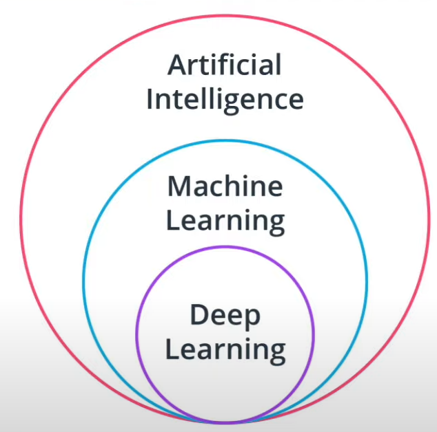

# Computer Vision

생성일: 2022년 11월 7일 오후 8:38
태그: 조수완

## 1. ****Prerequisites****

- Python
    - 객체 지향 프로그래밍의 개념
    - Library ⇒ numpy, matplotlib
- 미적분
- 선형 대수 지식 ⇒ 행렬 곱셈 및 내적

## 2. Key Stakeholders

- 사회에 미치는 영향
    - 통근 경험의 향상 ⇒ 통근자들은 운전할 시간에 다른 업무를 볼 수 있다.
    - 교통량 감소
    - 자동차 사고 수 감소
    - 현대 도시의 배치 변화
    - 대기 오염 완화
- 엔지니어링 팀
    - Operation team
        - Data acquision, labeling, mapping
    - Hardware team
        - Lidar 나 카메라와 같은 다양한 센서 개선
        - 자동차의 다양한 알고리즘 기반 임베디드 시스템 개발
    - Data engineering team
        - Data pipelines ⇒ 센서 → 클라우드까지의 데이터 흐름 보장을 위해

## 3. Machine Learning

- Artificial Intelligence (AI)
    - 외부 데이터로부터 학습하고 이 지식을 사용하여 특정 작업을 수행하는 시스템
    - Machine Learning 과 차이점 : 명시적인 프로그래밍 필요
    - ex) 비디오 게임의 논플레이어 캐릭터

- Machine Learning (ML)
    - 하드 코딩된 규칙대신 데이터로 학습 ⇒ 해당 데이터를 학습하는 알고리즘 훈련 필요
- Deep Learning (DL)
    - 신경망 기반 (머신 러닝 알고리즘의 일종) ⇒ 머신 러닝 알고리즘의 하위 집합
    - 네트워크의 계층 수를 나타냄
    - 원시 데이터로 작업 가능

## 4. ****Supervised Learning****

### 1) ****Supervised Learning vs. Unupervised Learning****

| Supervised Learning | Unupervised Learning |
| --- | --- |
| 레이블이 지정된 데이터 필요 | 원시 데이터(레이블X)를 알고리즘에 사용 가능 |
| 레이블 지정 작업 ⇒ 엄청난 비용 발생 |  |

### 2) 용어

| X | Input variable | Observation | 알고리즘에 대한 입력 데이터 |
| --- | --- | --- | --- |
| Y (Ground truth) | Output variable | Label (annotated) | 입력 데이터와 관련된 레이블로 나온 출력 데이터 |
| Y hat | Output variable | Prediction (predicted) | 입력 데이터에 대한 모델 예측로 나온 출력 데이터 |

## 5. **Artificial neural networks (ANN)**

⇒ 인간 신경망 기반 머신러닝 알고리즘

- Neurons(뉴런)
    - 신경망의 기본 단위
    - 입력 신호를 받아 입력값과 뉴런의 가중치 기반으로 활성화 여부 결정
- Layer
    - 여러 개의 뉴런을 포함한 구조
    - 레이어를 쌓아 신경망 만듬

※ Firing(발화) : 뉴런이 활성될 때