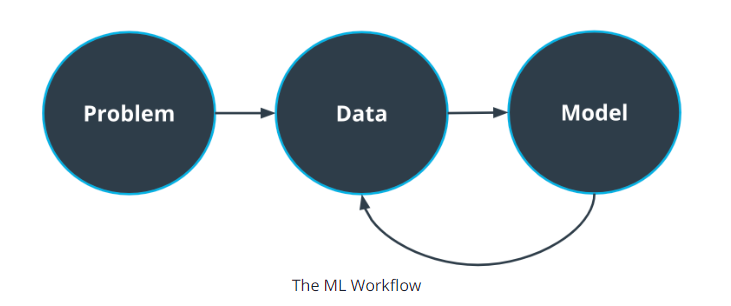

# Computer Vision2
## TensorFlow

- 머신러닝 모델을 손쉽게 개발, 훈련, 배치할 수 있도록 해주는 머신 러닝 라이브러리
- 주로 Python library Interface (C++ 기반)

## Waymo Open Dataset

- Waymo 는 자율 주행 자동차 기술의 리더 중 하나
- Waymo Open Dataset 에는 다양한 위치와 조건에서 라이더와 카메라 센서의 고품질 데이터가 많이 포함되어 있다.

[Sign in - Google Accounts](https://waymo.com/open/terms)

## Tools

- 구글 클라우드 플랫폼(GCP)에서 호스팅하는 Dataset 사용 → 클라우드에 저장된 객체를 제어하기 위한 구글 Command Interface인 gsutil 사용
- 버전 제어 플랫폼 = GitHub
- Rapid Prototyping을 위한 Jupyter Notebook 사용
- IDE = Visual Studio or Pycharm

<aside>
💡 현재 자율주행은 여러 대의 카메라에서 수집한 프레임으로 이루어지며 각각의 프레임에는 레이블이 지정됨

</aside>

## Project : Object Detection in an Urban Environment

- WaymoDataset를 사용해 자동차, 보행자, 자전거를 감지하고 분류하는 물체 감지 알고리즘
- TensorFlow 물체 감지 API 사용법
- 다양한 매개변수 세트로 여러 번에 걸쳐 알고리즘을 훈련
- 모델의 한계를 파악하기 위한 심층 오류 분석 수행
- 머신 러닝 엔지니어의 전체 워크플로우에 대해 깊이 이해 가능

```python
인공 지능(AI): 환경 정보를 활용하여 의사 결정을 내리는 시스템. 예를 들어 비디오 게임 봇이 있습니다.
인공 신경망(ANN): 인간 신경망을 막연하게 기반으로 하는 기계 학습 알고리즘.
딥 러닝(DL): 수작업 기능이 필요하지 않고 원시 데이터로 작업할 수 있는 ML 알고리즘의 하위 집합입니다. 예를 들어, 컨볼루션 신경망이 있는 객체 감지 알고리즘입니다.
레이어: 여러 개의 뉴런을 포함하는 구조. 레이어를 쌓아 신경망을 만듭니다.
머신 러닝(ML): 명시적으로 프로그래밍할 필요가 없고 대신 데이터에서 학습하는 AI입니다. 예를 들어 스팸 분류 알고리즘입니다.
뉴런: ANN의 기본 단위. 입력 신호를 받아 입력 값과 뉴런의 가중치를 기반으로 활성화 여부를 결정합니다.
TensorFlow: Python 인터페이스를 사용하는 ML 라이브러리. 여러 플랫폼에서 ML 알고리즘을 개발, 교육 및 배포하는 데 매우 유용합니다.
TensorFlow Object Detection API: 이 API는 TensorFlow에서 객체 감지 모델의 교육 및 개발을 단순화합니다.
```

---

# Macine Learning Workflow

## Machine Learning?

- 컴퓨터가 데이터로부터 정보를 추출하는 방법을 학습하는 인공지능의 한 유형

## Macine Learning Workflow: The Big Picture



- 예시 : 교통 표지 분류(Classifying Traffic Signs)
    - Problem : 교통 표지 분류
    - Data : 각 교통 신호 유형에 대한 수천 개의 이미지로 구성된 데이터
    - Model : Logistic Regression(범주형 변수를 예측하는 모델), Neural Network

## Framing the Problem

1. 머신 러닝이 필요한가? → 하드 코딩된 규칙 집합을 사용하여 해결 가능할 수도 있다.
2. 주요 이해 관계자 식별
    1. 비즈니스 문제를 해결
    2. 우리가 해결하려고 하는 문제에 누가 신경 쓰는가
3. 제약 조건과 목표는? → ex) 데이터 : 병목현상 → 데이터 파이프라인 이해
    1. 데이터는 어디서 오는가
    2. 얼마나 많은 데이터에 접근할 수 있는가
    3. 입수하고 주석을 다는 비용이 얼마나 드는가
4. 문제와 관련된 측정항목 결정
    1. 정밀도, 재현율, 정확도 

## Identifying the Key Stakeholders

1. 우리가 만들고 있는 알고리즘의 영향을 받는 사람은 누구인가?
- ex) 차량 공유 앱 : 운전자와 클라이언트 사이의 최적의 경로 찾기 위한 머신 러닝 모델 생성
    - 운전자 : 알고리즘이 도착 시간을 정확하게 예측하지 못하면 운전자은 곤란해진다.
    - 우리(알고리즘 개발) : 운전자가 승차?를 수락하거나 거부하는 것은 우리의 예측에 영향을 준다.
    - 엔지니어링 팀 : 앱에서 가장 정확한 시간 범위를 표시해야하는 UI 엔지니어링 팀 같은 곳에서 관심을 가짐

## Choosing Metrics

- 문제를 얼마나 잘 해결하는지 평가하기 위해 측정항목(Metrics Set) 을만들려고 한다. → 여기에서의 측정항목은 알고리즘 성능을 평가하는 데 사용하는 측정항목과 다를 수 있다.
- 좋은 측정항목은 이해하기 쉽고 특정 문제에 맞게 설정되어야 함
    - ex) 교통 표지 분류
        - 정확도 or 재현율을 사용하여 모델의 성능을 평가 가능 → 특정 교통 표지판을 다른 표지판보다 정확하게 분류하는데 더 많은 가중치 둘 수 있음
            - ex) 속도 제한 표지판을 잘못 읽으면 벌금 발생, 표지판을 놓쳤을 때 사고로 이어짐.
- 머신 러닝 측정 항목은 정확도 마찬가지로 문제 전반에 걸쳐 일반화할 수도 있다.
- 상황에 가장 적합한 맞춤형 비즈니스 측정 항목을 찾아야 할 수도 있다.
- ex) 이미지가 햄버거를 포함하고 있는지에 대한 여부를 분류하는 앱
    - 머신 러닝 측정 항목에 대한 정의?
        
        
        
        - True positive(TP) : 이미지에 버거가 포함되어 있고 모델이 버거를 예측하는 경우
        - True negativbe(TN) : 이미지에 버거가 포함되어 있지 않고 모델이 버거를 예측하지 않는 경우
        - False positive(FP) : 이미지에 버거가 포함되어 있지 않지만 모델이 버거를 예측하는 경우
        - False negative(FN) : 이미지에 버거가 포함되어 있고 모델이 버거를 예측하지 않는 경우
        
        <aside>
        💡 True/False 는 모델의 예측 결과와 실제 결과를 비교한 결과(모델 예측 결과에 대한 True/False)
        Positive/Negative 는 모델의 예측 결과
        
        뒤에서부터 해석하는게 편한것 같다.
        ex) FN : 모델은 없다고 예측했지만 결과는 False → 실제로는 존재
        
        </aside>
        
        
        
        - 위에 보이는 것과 같이 각 측정항목의 갯수를 표시하는 2X2 행렬을 Confuse Matrix(혼동 행렬) 라고 한다.
        - TP,TN,FP,FN는 많은 머신 러닝 층정항목의 기본 블럭(building blocks)이 된다.

## Classification Metrics (****분류성능평가지표)****

Confuse Matrix 는 단독적으로 사용되는 경우도 있지만 다음과 같은 측정항목을 생성하기 위해 사용되는 경우도 있음

1. Precision(정밀도) : True positive와 False positive 의 비율
    1. $Precision = TP/(TP+FP)$
    2. True로 판단한 것 중에 실제로 있는 것의 비율
2. Recall(재현율) : True positive 와 False nagative 의 비율
    1. $Recall = TP/(TP+FN)$
    2. 실제 존재하는 것 중에 실제로 있다고 판단한 비율
3. Accuracy(정확도)
    1. $Accuracy = (TP+TN)/(TP+FN+FP+TN)$
    2. 전체 결과에서 올바르게 판단한 비율

### IOU(Intersection Over Union)

- 물체 감지할 때 True/False 는 어떻게 판단하는가? IOU
- 객체 감지와 관련하여 매우 중요한 개념


- IOU는 boundubg boxes 2개의 합집합의 비율로 정의
- Ground-truth bounding box 와 detected bounding box 사이의 IOU 0.5는 True/False를 구분하는데 매우 일반적인 임계값
- NMS(non-max suppression) 같은 알고리즘에 사용된다.


두 box의 크기가 동일할 때 적어도 2/3은 겹쳐야 IOU가 0.5정도 나옴

---

※ 참고 링크

[분류성능평가지표 - Precision(정밀도), Recall(재현율) and Accuracy(정확도)](https://sumniya.tistory.com/26)

[IoU, Intersection over Union 개념을 이해하자](https://ballentain.tistory.com/12)

[Classification: True vs. False and Positive vs. Negative | Machine Learning | Google Developers](https://developers.google.com/machine-learning/crash-course/classification/true-false-positive-negative)